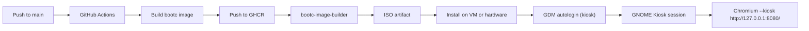

# Image Mode Shenanigans

Bootable Fedora kiosk OS, built with `bootc`, published as both a GHCR image and a bootable ISO.

## Why This Repo Exists

This project turns a single repo into a reproducible kiosk platform:

- Builds a bootable OS image from `Containerfile`.
- Publishes OCI tags to GHCR (`latest` and commit SHA).
- Produces an installable ISO via `bootc-image-builder`.
- Boots into GNOME Kiosk, autologs user `kiosk`, and opens Chromium in kiosk mode.
- Injects a `break-glass` admin user at ISO build time from GitHub Actions secrets.

## System Overview



## Repo Map

- `Containerfile`: Bootable OS definition.
- `.github/workflows/image-build.yml`: Build + publish + ISO pipeline.
- `bootc/config.toml`: bootc-image-builder customization baseline.
- `bootc/build.toml`: Helper metadata for image/build paths.
- `config-files/gdm-custom.conf`: GNOME Display Manager autologin + default session config.
- `config-files/gnome-kiosk.session`: GNOME Kiosk session components.
- `config-files/kiosk-chromium.sh`: Chromium kiosk launch loop.
- `config-files/dconf-00-kiosk`: GNOME lock/suspend/power defaults.
- `config-files/kiosk-nginx.container`: Quadlet container definition for local content.
- `index.html`: Kiosk web UI/content.

## How To Consume What It Builds

### 1. Use the Generated ISO (Fastest Path)

1. Open the latest successful run of `Build, Push, and Build bootc ISO`.
2. Download artifact `bootc-iso-<sha>`.
3. Boot a VM or machine from that ISO.
4. Install and reboot.

Expected post-install behavior:
- No manual GNOME login prompt.
- Chromium opens in kiosk mode automatically.
- `break-glass` user exists and is in `wheel`.

### 2. Use the Published GHCR Image

```bash
IMAGE_REF="ghcr.io/<owner>/<repo>:latest"
mkdir -p output
sudo podman pull "$IMAGE_REF"

sudo podman run --rm --privileged \
  --security-opt label=type:unconfined_t \
  -v "$(pwd)/output:/output" \
  -v /var/lib/containers/storage:/var/lib/containers/storage \
  quay.io/centos-bootc/bootc-image-builder:latest \
  --type anaconda-iso \
  --rootfs xfs \
  "$IMAGE_REF"
```

## Clone It And Make Your Own

```bash
git clone https://github.com/<your-org-or-user>/image-mode-shenanigans.git
cd image-mode-shenanigans
```

Then customize in this order:

1. Edit kiosk content in `index.html`.
2. Edit browser behavior in `config-files/kiosk-chromium.sh`.
3. Adjust login/session defaults in `config-files/gdm-custom.conf`.
4. Adjust GNOME lock/power defaults in `config-files/dconf-00-kiosk`.
5. Adjust bootc disk sizing in `bootc/config.toml`.
6. Update your image reference in `bootc/build.toml`.
7. Push to `main` to trigger image + ISO builds.

## GitHub Actions Requirements

Workflow file: `.github/workflows/image-build.yml`

Required secrets:

- `BREAK_GLASS_PASSWORD`
- `BREAK_GLASS_SSH_PUBLIC_KEY`

What CI does:

1. Builds/pushes image to `ghcr.io/<owner>/<repo>`.
2. Copies `bootc/config.toml` into a temporary config.
3. Appends:

```toml
[[customizations.user]]
name = "break-glass"
password = "<from-secret>"
key = "<from-secret>"
groups = ["wheel"]
```

4. Builds ISO with `--config /config.toml`.
5. Uploads ISO artifacts.

## Troubleshooting

- GNOME still shows login screen:
```bash
sudo systemctl status gdm
sudo cat /etc/gdm/custom.conf
```

- Chromium does not launch:
```bash
cat /var/home/kiosk/kiosk-session.log
```

- Kiosk page not reachable:
```bash
sudo systemctl status kiosk-nginx.service
curl -I http://127.0.0.1:8080/
```

## Notes

- This repo is intentionally image-first: you version the OS behavior and app content together.
- `break-glass` is created during ISO build customization, not hardcoded into the base image layer.
